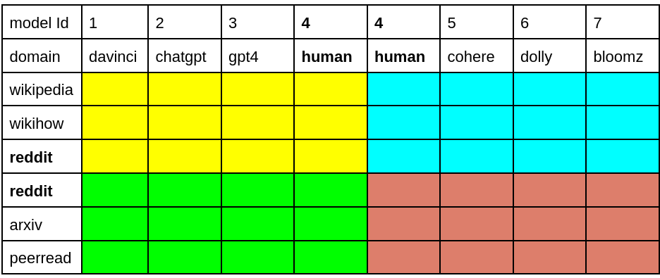

# M4GT-Bench: Evaluation Benchmark for Black-Box Machine-Generated Text Detection
<p align="center" style="display: flex; flex-direction: row; justify-content: center; align-items: center">
📄 <a href="https://arxiv.org/pdf/2402.11175" target="_blank" style="margin-right: 15px; margin-left: 10px">Paper</a> • 
🤗 <a href="" target="_blank" style="margin-left: 10px">Dataset</a> •  
🔱 <a href="" target="_blank" style="margin-left: 10px">Detector</a>
</p>

## Overview
<p align="center"> </p>

## Dataset
<p align="center"> </p>
<p align="center"> </p>
<p align="center"> </p>

## Detectors


#### Task 1 Results

## Human Evaluation


<p align="center"> </p>


## Citation
If our work is useful for your own, you can cite us with the following BibTex entry:
```bibtex
@article{wang2024m4gt,
  title={M4GT-Bench: Evaluation Benchmark for Black-Box Machine-Generated Text Detection},
  author={Wang, Yuxia and Mansurov, Jonibek and Ivanov, Petar and Su, Jinyan and Shelmanov, Artem and Tsvigun, Akim and Afzal, Osama Mohanned and Mahmoud, Tarek and Puccetti, Giovanni and Arnold, Thomas and others},
  journal={to appear in ACL 2024},
  year={2024}
}
```
