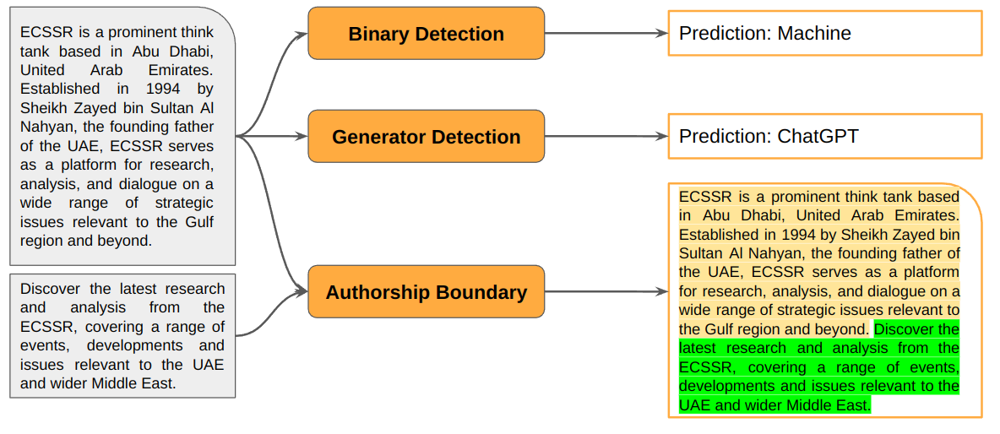
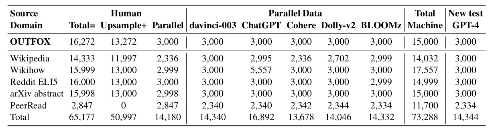
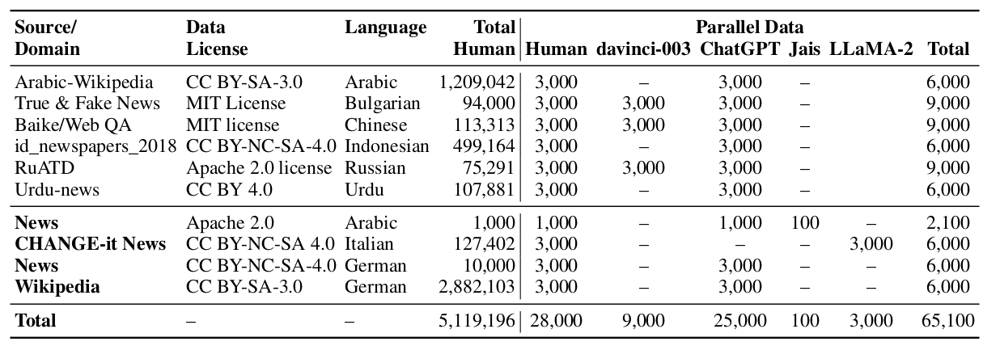
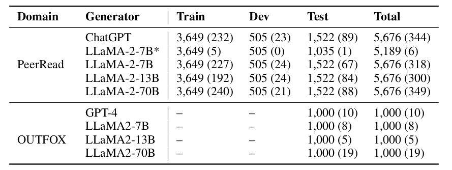
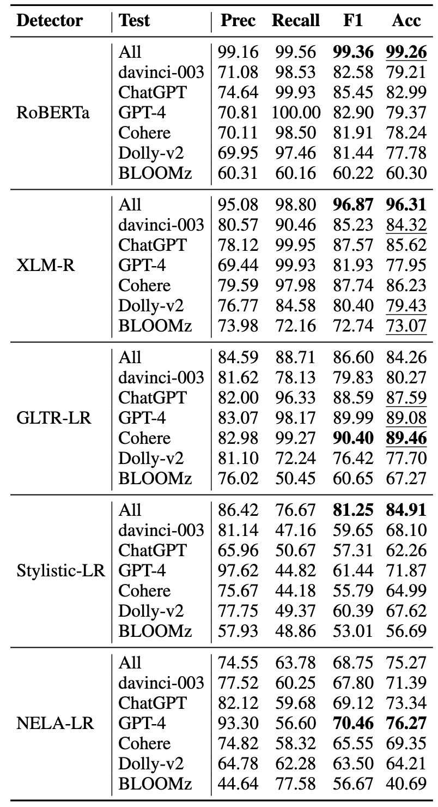
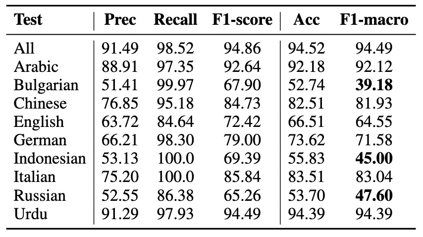
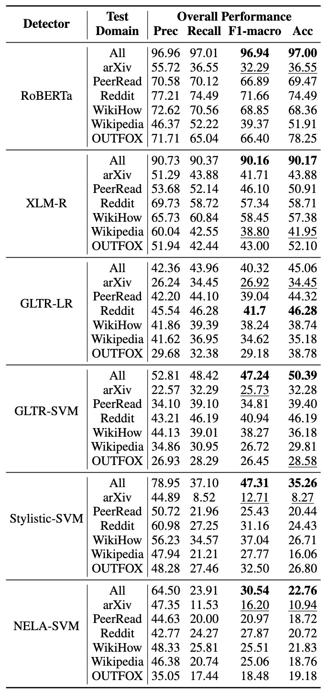
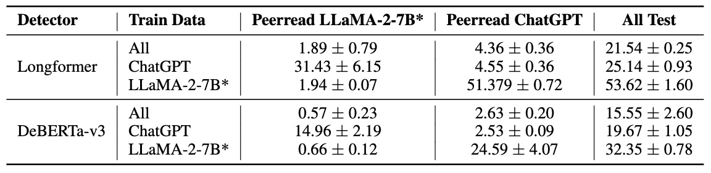
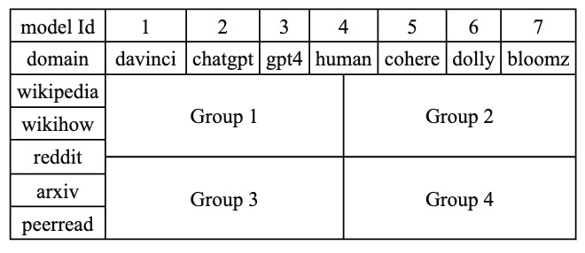
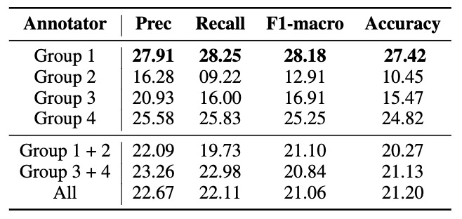

# M4GT-Bench: Evaluation Benchmark for Black-Box Machine-Generated Text Detection
<p align="center" style="display: flex; flex-direction: row; justify-content: center; align-items: center">
📄 <a href="https://arxiv.org/pdf/2402.11175" target="_blank" style="margin-right: 15px; margin-left: 10px">Paper</a> • 
🤗 <a href="https://drive.google.com/drive/folders/1hBgW6sgZfz1BK0lVdUu0bZ4HPKSpOMSY?usp=sharing" target="_blank" style="margin-left: 10px">Dataset</a> •  
🔱 <a href="https://github.com/mbzuai-nlp/M4GT-Bench/tree/main/src" target="_blank" style="margin-left: 10px">Detector</a>
</p>

## Overview
M4GT-Bench: **M**ultilingual, **M**ultidomain, and **M**ulti-generator corpus of **M**GTs. The benchmark is compiled of three tasks: (1) mono-lingual and multi-lingual binary MGT detection; (2) multi-way detection where one need to identify, which particular model generated the text; and (3) mixed human-machine text detection, where a word boundary delimiting MGT from human-written content should be determined.

<p align="center"> </p>

## Dataset
#### English:
<p align="center"> </p>

#### Multilingual:
<p align="center"> </p>

#### Mixed:
<p align="center"> </p>


## Detectors


#### Task 1 Results
##### Monolingual

<p align="center"> </p>

##### Multilingual
<p align="center"> </p>

#### Task 2 Results
<p align="center"> </p>

#### Task 3 Results
<p align="center"> </p>

## Human Evaluation

#### Sampling
We split 140 examples into four groups, each involving three domains and four generators, with 48 examples including five demonstrations for learning.

<p align="center"> </p>

#### Results
<p align="center"> </p>


## Citation
If our work is useful for your own, you can cite us with the following BibTex entry:
```bibtex
@article{wang2024m4gt,
  title={M4GT-Bench: Evaluation Benchmark for Black-Box Machine-Generated Text Detection},
  author={Wang, Yuxia and Mansurov, Jonibek and Ivanov, Petar and Su, Jinyan and Shelmanov, Artem and Tsvigun, Akim and Afzal, Osama Mohanned and Mahmoud, Tarek and Puccetti, Giovanni and Arnold, Thomas and others},
  journal={to appear in ACL 2024},
  year={2024}
}
```
